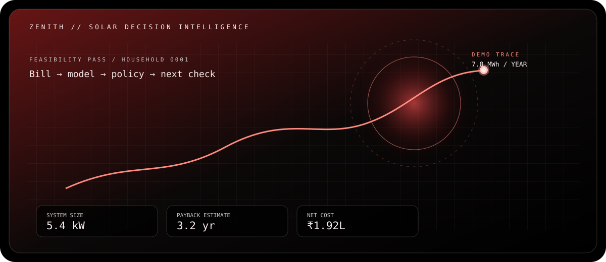
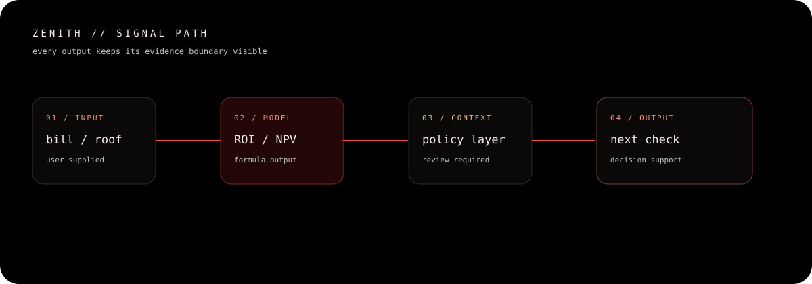

# Zenith // Solar Decision Intelligence

**Status: DEMO / EXPERIMENTAL**

Zenith is an India-focused rooftop-solar decision surface. It turns a monthly bill, a roof context, and a policy assumption into a workflow that can be inspected before an installation decision is made.



## What is in the repository

The product is organized around five decision modules:

| Module | Route | Evidence state | What it does |
| --- | --- | --- | --- |
| Payback Pulse | `/service1` | `MODEL / ACTIVE` | System sizing, generation, cost, savings, and payback from structured inputs. |
| 20-Year Vision | `/service2` | `ESTIMATE / PARAMETRIC` | Long-horizon cashflow, tariff, degradation, financing, and return scenarios. |
| Subsidy Scout | `/service3` | `POLICY / REVIEW` | Central/state subsidy context and eligibility estimates. |
| Photon Hunter | `/service4` | `BETA / IMAGE` | Rooftop image/video analysis and placement exploration. |
| Grid Guardian | `/lumen` | `EXPERIMENTAL / LUMEN` | Microgrid optimization and peer-to-peer flow exploration. |

The calculation and route boundaries remain in the codebase:

- `zenith-app/lib/solarCalculations.ts` and `rooftopSolarCalculations.ts` contain the core client-side calculations.
- `zenith-app/lib/lumen/` contains the Lumen types and optimization layer.
- `zenith-app/app/api/` contains the bill parser, Gemini explanation, rooftop, and Lumen route handlers.
- `zenith-app/app/(dashboard)/` contains the protected module routes.



## Evidence boundary

Numbers shown in the landing console and sample projection are illustrative demo values. A calculation result is an estimate tied to its inputs; it is not a quote, approval, subsidy guarantee, engineering sign-off, or production telemetry reading.

The following are intentionally not claimed by this repository:

- an independently verified hosted deployment;
- production-grade identity, billing, or installer operations;
- guaranteed MNRE/state subsidy outcomes;
- rooftop suitability without a physical survey;
- live microgrid control from the Lumen experience.

## Local verification

Requirements: Node.js 20+ recommended.

```powershell
npm ci --prefix zenith-app
npm run design:check --prefix zenith-app
npm run build --prefix zenith-app
npm run start --prefix zenith-app
```

Open `http://localhost:3000` (or the port printed by Next.js). The local demo account is:

```text
admin@zenith.com / zenith123
```

This credential is only for the local demo flow. It is not a production authentication system.

## Visual system

The interface follows the YOR visual framework: void black, graphite panels, crimson signal accents, warm white type, technical annotations, quiet grids, and explicit evidence-state vocabulary. The source contract is `design/yor-tokens.json`; run `npm run design:check --prefix zenith-app` after changing it.

## Project structure

```text
design/                  YOR token contract and checks
assets/                  code-authored hero and architecture visuals
zenith-app/app/          Next.js routes and API handlers
zenith-app/components/   shared navigation and module components
zenith-app/lib/          solar, rooftop, Gemini, and Lumen logic
```

## Contributors

- Nivedana — platform architecture, full-stack development, and backend logic
- Ayush — interface direction and product experience
